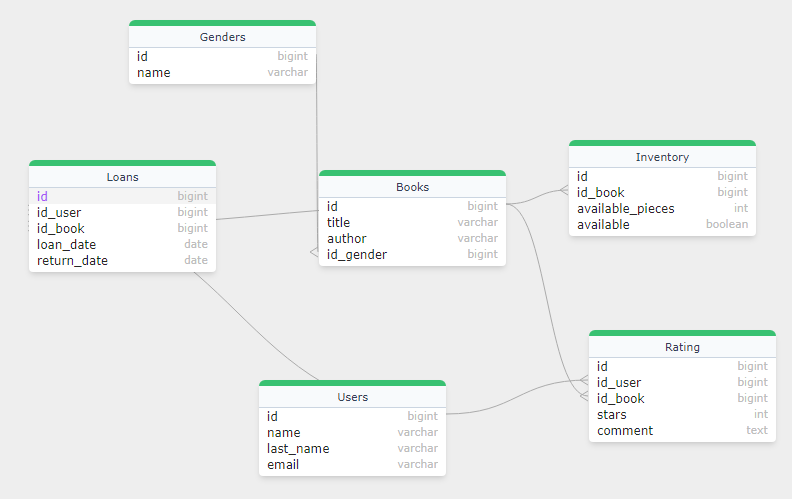
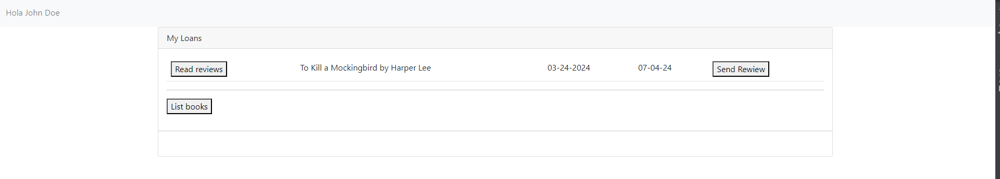

<a name="readme-top"></a>

# BookStore
### ximple challenge
## Table of Contents
<details open>
   <ol>
      <li><a href="#prerequisites">Prerequisites</a></li>
      <li><a href="#getting-started">Getting Started</a></li>
      <li><a href="#built-with">Built With</a></li>
      <li><a href="#running-the-tests-and-coverage">Running the Tests and Coverage</a></li>
   </ol>
</details>

## Prerequisites

* Install Java 21
* Install Docker Compose

## Getting Started

These instructions will get you a copy of the project up and running on your local machine for development and testing purposes.

1. Clone the repo
   ```sh
   git clone git@github.com:drupalio/BookStoreChallenge.git
   ```
2. Import the project in your IDE
3. Sync Gradle dependencies
4. Setup dev environment
    ```sh
    docker-compose -f docker-compose.yml up
    ```
5. Teardown dev environment
    ```sh
    docker-compose -f docker-compose.yml down
    ```

## Outbox pattern implementation
* Access to main page dashboard and send a petition to the API to list user loans.
* List all loans and review which are without returning and give the option to return.
* Offer the possibility to send a review if you've already returned a book.
* Print a button to list a specific book or all books and take it as a loan.

<p align="right">(<a href="#readme-top">back to top</a>)</p>

## Database Model

* When I designed the database, I did it with the following questions in mind:
* Is it possible to know if there are pieces of books available?
* Is it possible to know which user has a copy?
* Is it possible for a book to receive a review?
* Can we know how many books a user has on loan?

Although the model can be further refined to achieve better performance and have superior quality in terms of indexes by using better properties for indexing, this will remain pending due to the deadline.
<p align="right">(<a href="#readme-top">back to top</a>)</p>


## Architectural Design*
* I decided to use a monolithic architecture for creating the API due to development time, primarily considering the time it would take me to debug a fragmented API across different microservices.
* I used Spring Boot to expedite development times and due to the community's maintenance towards the project. While it's possible that Quarkus may offer superior performance, its documentation is deficient compared to Spring's.
* I employed Bootstrap as the foundation for CSS due to its ease of use and style.
* I chose jQuery over Vue or Angular because prototyping a front-end would take longer with the latter options, and debugging HTMX templates would be too time-consuming.
* I selected H2DB because it's written in Java and can be interacted with directly, using Java code for creating more complex objects.
* I utilized Hibernate as an ORM to avoid having to use as many lines of SQL.

<p align="right">(<a href="#readme-top">back to top</a>)</p>

## SWAGGER and OpenAPi
* The Api is documented using swagger and the openapi spec, you could review it through:
  ```html
    http://localhost:8080/swagger-ui/index.html
    ```

## Observability and Monitoring
* You can check the heald and the relevant information for monitoring through the 14 exposed endpoints of actuator:
  ```html
    http://localhost:8080/actuator
    ```


<p align="right">(<a href="#readme-top">back to top</a>)</p>

## Flyway and the database migrating through time
* I decided to use Flyway to maintain the consistency and correct structure of my database. You only need to add the dependency of Flyway and follow the naming conventions. For example:

  Dependency
    ```xml
    <dependency>
    <groupId>org.flywaydb</groupId>
    <artifactId>flyway-core</artifactId>
    </dependency>
    ```
  Name conventions
  ```html
    V#_#__PREFIX_POSTFIX.SQL
    ```
where the first # is the major version of migration and the secon one # is for a migration revision.

<p align="right">(<a href="#readme-top">back to top</a>)</p>

## Database Model

Example user:

    Email: john.doe@example.com
    Password: password

### Demo URL  
    http://localhost/

You could choose whichever user you want inserted in the V2__insert_users.sql
## Built With

* [Java 21][java-url] - Runtime and programming language.
* [Maven 3.9.6 ][maven-url] - Main build tool management.
* [Docker][docker-url] - Containerize applications for consistency.
* [H2DB][h2db-url] - In memory database dbms writed on java
* [Redis ][redis-url] - Cache Manager tool
* [Spring Boot][spring-boot-url] - Production-grade Spring based Applications that you can "just run".

<p align="right">(<a href="#readme-top">back to top</a>)</p>

## Running the Tests and Coverage

* [JUnit 5][junit5-url]


<!-- MARKDOWN LINKS & IMAGES -->
<!-- https://www.markdownguide.org/basic-syntax/#reference-style-links -->
[java-url]: https://openjdk.org/projects/jdk/17/
[maven-url]: https://maven.apache.org/
[docker-url]: https://www.docker.com/
[h2db-url]: https://www.h2database.com/
[redis-url]: https://redis.io/
[spring-boot-url]: https://spring.io/projects/spring-boot
[junit5-url]: https://junit.org/junit5/
[jacoco-url]: https://www.jacoco.org/jacoco/
